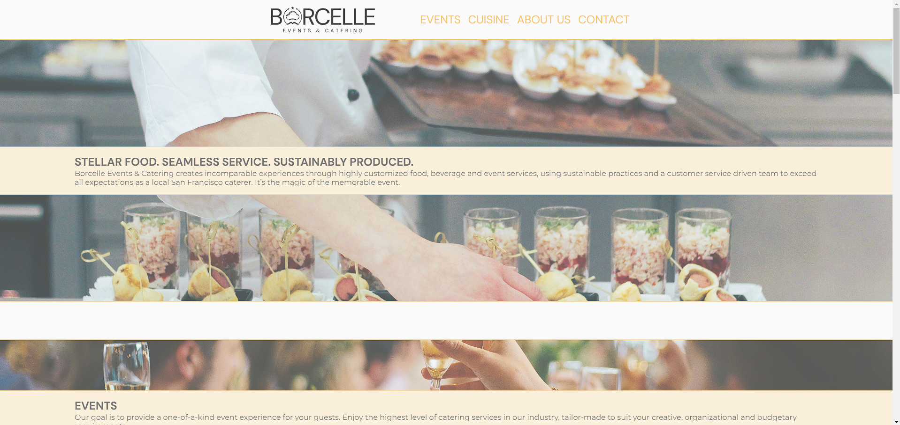

# Borcelle Events and Catering Company Homepage

Welcome to the Borcelle Events and Catering Company Homepage project! This project showcases the design and layout of a company homepage for Borcelle Events and Catering, an elegant food catering service, using flexbox.

## Project Overview

This project involves designing and building the layout for a company's homepage using flexbox. The goal is to create an elegant and visually appealing homepage that effectively represents the brand and services of Borcelle Events and Catering.

## Project Goals

- Design and build the layout for Borcelle Events and Catering Company homepage using flexbox.
- Create an elegant and visually appealing design that reflects the brand identity of Borcelle Events and Catering.
- Incorporate relevant content sections such as event services offered, cuisine, about us, contact information, etc.
- Use images, colors, typography, and other design elements to enhance the overall aesthetic and user experience.

## Usage

To view the Borcelle Events and Catering Company Homepage project, simply visit the live demo [https://lisbrow.github.io/company_homepage/](https://lisbrow.github.io/company_homepage/) in your web browser.

## Languages Used

- HTML
- CSS (with flexbox)
